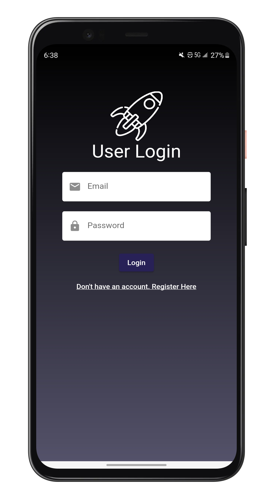
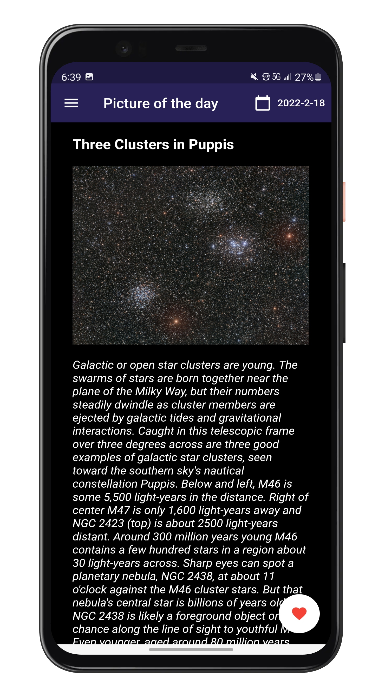
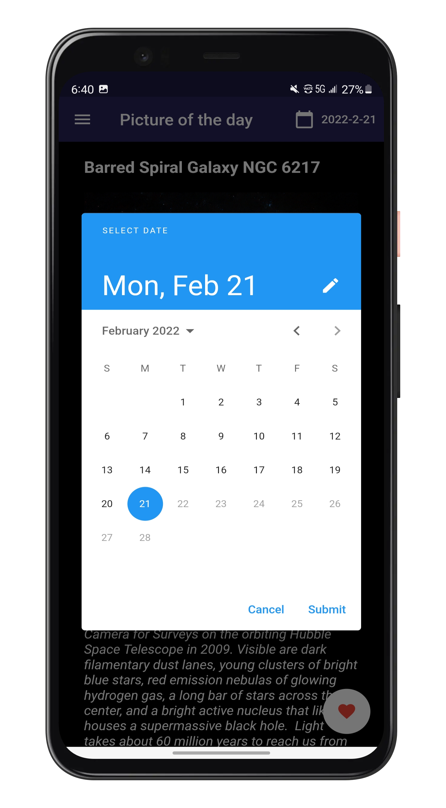
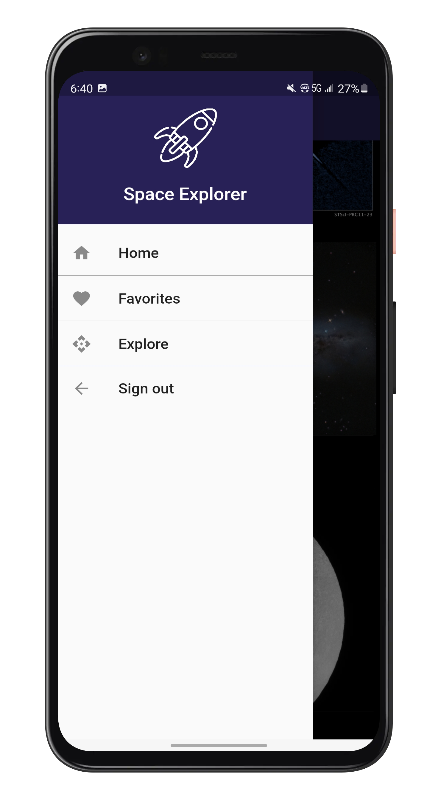
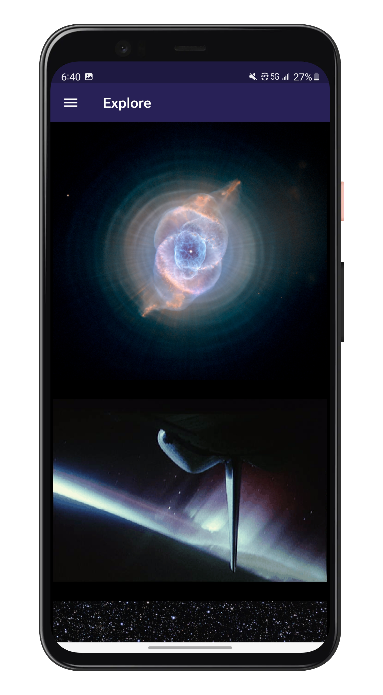

# Space Explorer

A new Flutter project.

## About

This project uses an api called Astronomical Picture of the day to retrieve image of space.
Also uses firebase for authentication and firestore as its database to save images the user liked.

## Screenshots

